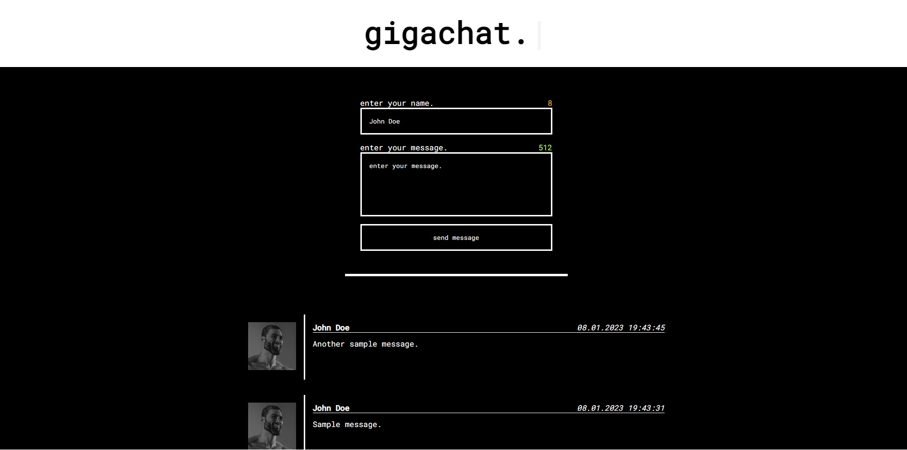
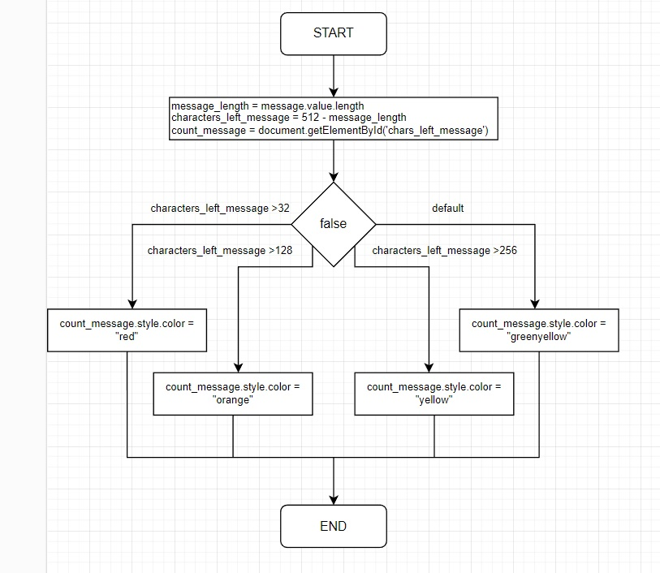

# gigachat
### Chatting website for a school project.
[LINK to online preview](https://gigachat.000webhostapp.com/)

gigachat is a simple dark themed chatting website comprising of the chatting form (name + message) and displayed messages. 
It is written in:

- HTML
- CSS
- PHP
- JavaScript

### Features/functions

- Enter your name and message
- See the amount of remaining characters you have
- Submit your message and see it either be added or declined if conditions were not met, using a cool animated alert
- See messages submitted by others in real time
- Nice title animation and preloader
- Fully responsive layout (hopefully)

### Diagram of messageLengthCheck() function

